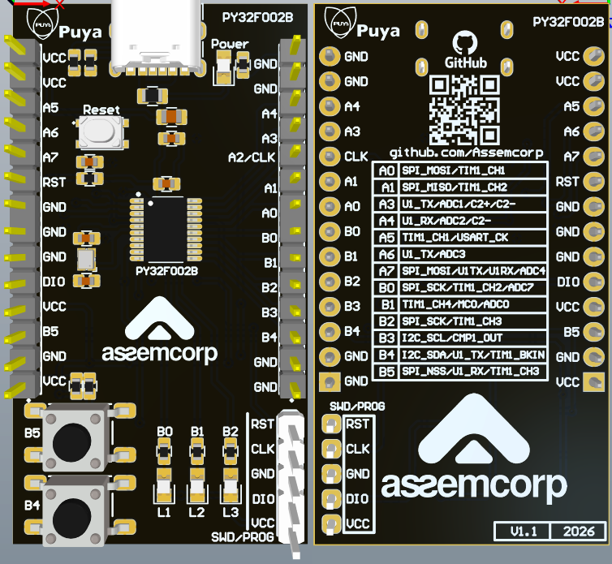

PY32F002B Firmware Project

This repository contains a sample project developed for the Puya PY32F002B microcontroller. It demonstrates basic peripheral usage and can serve as a starting point for your own applications.

📁 Project Structure

main.c – Main application logic

Keil/ – Project files for Keil uVision 5

Drivers/ – PY32 HAL drivers and headers

🔧 Development Environment IDE: Keil uVision 5.28

Debugger: J-Link Target MCU: PY32F002B

🚀 Features

GPIO

▶️ Getting Started Clone the repository: git clone https://github.com/../PY32F002B-project.git Open the project in Keil.

Configure required peripherals in app_config.h.

Compile and flash to the board using J-Link.

⚠️ Notes If you see trace hw not present in Keil, SWO trace is not supported on this chip. LiveWatch requires variables to be located in RAM and the project to be compiled with -O0 optimization.

@AssemCorpApplicationTeam

